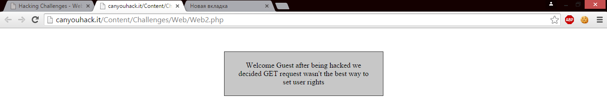
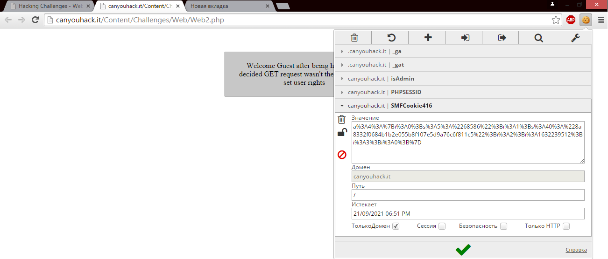
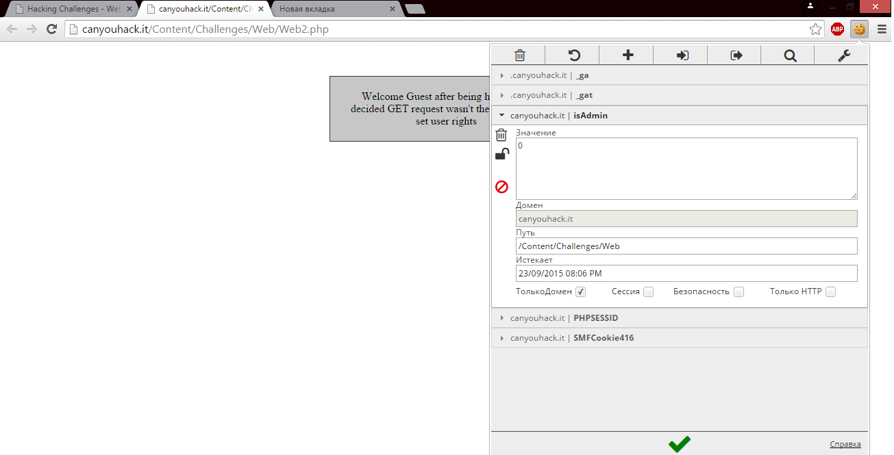
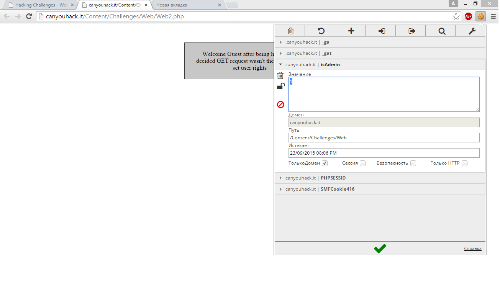
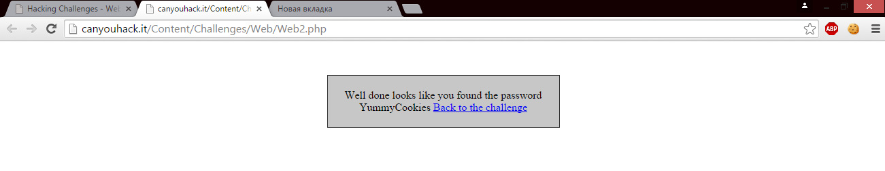

# Cookie

Куки — небольшой фрагмент данных, отправленный веб-сервером и хранимый на компьютере пользователя. Веб-клиент (обычно веб-браузер) всякий раз при попытке открыть страницу соответствующего сайта пересылает этот фрагмент данных веб-серверу в составе HTTP-запроса. Применяется для сохранения данных на стороне пользователя, на практике обычно используется для:

1. Аутентификации пользователя
2. Хранения персональных предпочтений и настроек пользователя
3. Отслеживания состояния сеанса доступа пользователя
4. Ведения статистики о пользователях

Куки используются веб-серверами для различения пользователей и хранения данных о них. К примеру, если вход на сайт осуществляется при помощи куки, то после ввода пользователем своих данных на странице входа, куки позволяют серверу запомнить, что пользователь уже идентифицирован, и ему разрешён доступ к соответствующим услугам и операциям. Многие сайты также используют куки для сохранения настроек пользователя. Эти настройки могут использоваться для персонализации, которая включает в себя выбор оформления и функциональности. Например, Википедия позволяет авторизованным пользователям выбрать дизайн сайта. Поисковая система Google позволяет пользователям (в том числе и не зарегистрированным в ней) выбрать количество результатов поиска, отображаемых на одной странице. Куки также используются для отслеживания действий пользователей на сайте. Как правило, это делается с целью сбора статистики, а рекламные компании на основе такой статистики формируют анонимные профили пользователей, для более точного нацеливания рекламы.

## Работа cookies
Запрашивая страницу, браузер отправляет веб-серверу короткий текст с HTTP-запросом. Например, для доступа к странице http://www.example.org/index.html, браузер отправляет на сервер www.example.org следующий запрос:
> GET /index.html HTTP/1.1 Host: www.example.org

Сервер отвечает, отправляя запрашиваемую страницу вместе с текстом, содержащим HTTP-ответ. Там может содержаться указание браузеру сохранить куки:
> HTTP/1.1 200 OK Content-type: text/html Set-Cookie: name=value
(содержимое страницы)

Строка Set-cookie отправляется лишь тогда, когда сервер желает, чтобы браузер сохранил куки. В этом случае, если куки поддерживаются браузером и их приём включён, браузер запоминает строку name=value (имя = значение) и отправляет её обратно серверу с каждым последующим запросом. Например, при запросе следующей страницы http://www.example.org/spec.html браузер пошлёт серверу www.example.org следующий запрос:
> GET /spec.html HTTP/1.1 Host: www.example.org Cookie: name=value Accept: /

Этот запрос отличается от первого запроса тем, что содержит строку, которую сервер отправил браузеру ранее. Таким образом, сервер узна́ет, что этот запрос связан с предыдущим. Сервер отвечает, отправляя запрашиваемую страницу и, возможно, добавив новые куки. Значение куки может быть изменено сервером путём отправления новых строк Set-Cookie: name=newvalue. После этого браузер заменяет старое куки с тем же name на новую строку. Куки также могут устанавливаться программами на языках типа JavaScript, встроенными в текст страниц, или аналогичными скриптами, работающими в браузере. В JavaScript для этого используется объект document.cookie. Например, document.cookie = "temperature=20" создаст куки под именем «temperature» и значением 20.

##EditThisCookie
Рассмотрим работу с расширением [EditThisCookie](http://www.editthiscookie.com/start/) для браузера [Chrome](https://www.google.ru/chrome/index.html) на примере решения таска:
* На данном скрине видно, что админы решили больше не давать нам права, используя GET-запрос, так что нужно искать какой-то другой способ решения  
* Возможно, хорошей идеей было бы проверить куки. И не зря, используя расширение, мы можем обратить внимание на поле "isAdmin"
* Стоит попробовать заменить значение 0 на 1 
* Изменяем, сохраняем и перезагружаем страницу 
* Вот и искомый флаг 