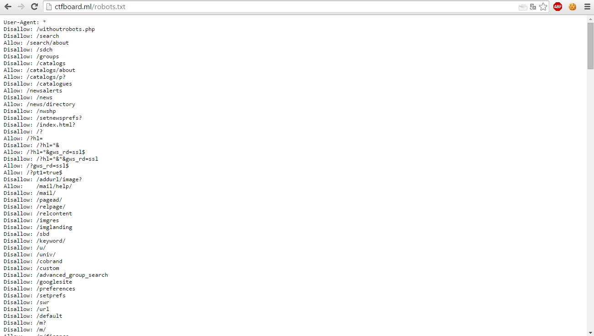

# robots.txt

Стандарт исключений для роботов (robots.txt) — файл ограничения доступа к содержимому роботам на http-сервере. Файл должен находиться в корне сайта (то есть иметь путь относительно имени сайта /robots.txt). При наличии нескольких поддоменов файл должен располагаться в корневом каталоге каждого из них.

Файл robots.txt используется для частичного управления индексированием сайта поисковыми роботами. Этот файл состоит из набора инструкций для поисковых машин, при помощи которых можно задать файлы, страницы или каталоги сайта, которые не должны индексироваться.

## Пример структуры:

## Решение таска
После открытия какого-либо задания в нем скорее всего будет подсказка, если задание будет связано с robots.txt. Смотрим файл robots.txt, и не забываем, что файл находится в корневой папке (пример: http://www.example.org/robots.txt)
В каких-то случаях этого бывает достаточно, флаг может находиться прям в файле robots.txt. Однако не всегда, в каких-то слушчаях это может быть лишь частью, необходимо внимательно изучить файл на наличие других файлов, которые тоже можно попробовать открыть (по аналогии с robots.txt) Пример подобного развития событий:
* 
* 
* 
* 

# robots.txt tool
Вставьте ссылку на сайт, на выводе будет файл robots.txt:

